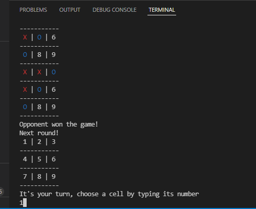

# rusty-tictactoe

Inspired by [Reinforcement Learning: An Introduction, Richard S. Sutton and Andrew G. Barto.](https://www.amazon.com.br/Reinforcement-Learning-Introduction-Richard-Sutton/dp/0262039249)

As part of my masters in theoretical physics, I've coded in Rust an ML model to teach a machine to play tic-tac-toe using Reinforcement Learning

After thousands of iterations playing with itself the machine becomes a perfect player and you as a human can never win,
you can only get to a draw at best!

I'v written this to experiment with the balance between exploitation vs exploration, that is,
when should the machine use what it has already learned vs when should it risk a new move and perhaps discover a better path to winning.

I've found best results with an exploration rate of 30% and a decay rate of 90%. Also the learning rate has been set to 40% so that the machine doesn't hold on too strongly to recent memories

Go play! You have to wait around a minute before the game starts, in that time the machine is playing thousands of times against itself, balancing exploration against explotation.

Once learning is done the machine switches to full-greedy mode to beat you!